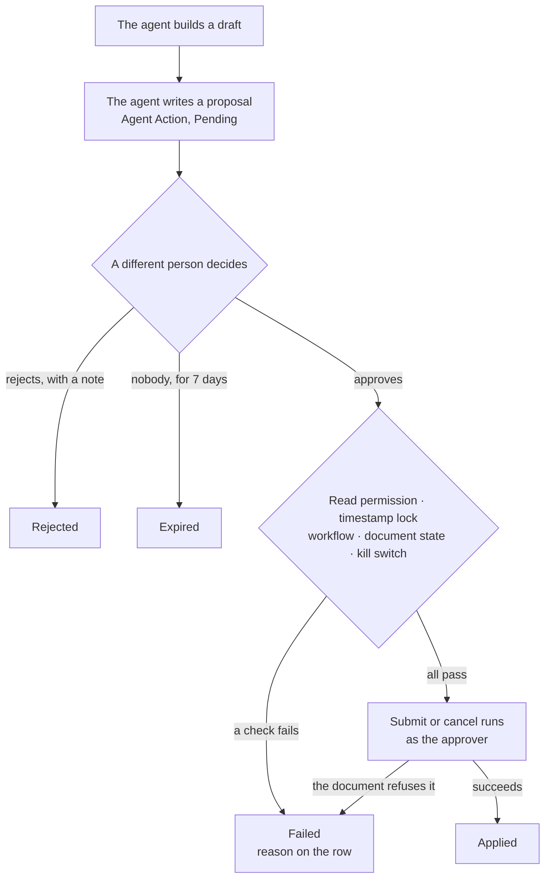

# Approvals

An agent can build a document. It cannot commit one. When an agent decides
something should be submitted or cancelled, it writes a proposal and stops, and
a person decides.

## What a proposal is

A proposal is an **Agent Action** row: a request, not an act. It names the
document, whether it wants a submit or a cancel, and the agent's reason. It also
stores the document's timestamp at the moment it was proposed — that snapshot
does more work than it looks like, below.

Nothing else can create one. The doctype grants create and write to no role at
all: a proposal arrives through the proposal tool and leaves through an
approval, a rejection, or expiry. There is no path where a row appears or
changes some other way.

Find them under **Agents → Review → Pending Actions**.

## Who may decide

You need the **Agent Approver** role, and you must not be any of these three
people:

- whoever asked for the proposal;
- whoever the run was acting as;
- whoever owns the agent.

An approval that none of those three could avoid making is not a review. If you
are blocked, the screen says which of the three you are.

## What you are agreeing to

Open the document and read it. The proposal is a request to submit or cancel
*that record as it now stands*, and approving is you saying you read it.

The app enforces that literally. Approving sends back the timestamp of the
version you looked at, and a document that changed underneath you refuses the
approval and asks you to read it again. This is a real check, not a courtesy:
frappe's own stale-document guard cannot fire on this path, so this timestamp is
the only thing standing between you and approving a version you never saw.

You also cannot approve a document you may not read. Read permission is proved
before anything is written — an approval of a record you cannot open is a
signature on a blank page.

## Approving

Approving applies the change **as you**. The submit or cancel runs in your own
session under your own permissions, with nothing bypassed. If you may not submit
that document by hand, approving does not submit it either.

That has a consequence worth expecting: **a failed apply is normal, not a bug.**
Submitting re-runs the document's full validation, so a draft that was valid
when the agent built it can legitimately fail now — a closed period, a credit
limit, a mandatory field somebody cleared. The proposal is recorded as **Failed**
with the reason on the row, and nothing is half-applied.

A few things are refused outright:

- **A document governed by an active Workflow.** Frappe does not stop a
  server-side submit on a workflow doctype — it would teleport the document past
  every approval step in the workflow. So proposals refuse those doctypes, and
  the refusal is checked again immediately before applying, in case the workflow
  was switched on in between. Use the workflow's own transitions.
- **A document no longer in the right state** — a submit proposal for something
  already submitted, a cancel for something that is not.
- **A document that no longer exists.**
- **Anything, while the kill switch is off.** A site that has stopped trusting
  the runtime should not be applying its output by hand either.

## Rejecting

Rejecting requires a note. That is deliberate — the note is the answer to the
proposal, and the agent's reason deserves one back.

Rejection works even when the kill switch is off. Emptying the queue is exactly
what a stopped site should still be able to do.

## Expiry

A proposal nobody decides expires after seven days, changeable at **Agent
Settings → Action Expiry Days**. A daily job sweeps them; a proposal past its
window is refused even if the sweep has not run yet.

Expiry is not a decision. Nobody is recorded as deciding it, and the agent is
free to propose the same thing again.

## The states

| Status | Means |
|---|---|
| **Pending** | Waiting for a person |
| **Applied** | Approved, and the submit or cancel went through |
| **Failed** | Approved, but the document refused it — reason on the row |
| **Rejected** | A person said no, with a note |
| **Expired** | Nobody decided in time |

## Did anyone actually read it?

Every applied proposal records **Edited Before Approval**: whether the document
changed between the agent proposing it and the approval going through. It is
computed just before the apply, because submitting overwrites the timestamp it
is measured against.

**Agents → Review → Review Quality** reports on it. Read it the right way round.
A high edit rate is not a problem — it means reviewers are reading drafts and
correcting them, which is the system working. A rate at or near zero across many
approvals and many approvers is the signal worth investigating: it can mean the
agent is excellent, and it can mean nobody is looking.

It measures applied proposals only. A rejection applied nothing, so it is left
out rather than counted as an unedited approval.
