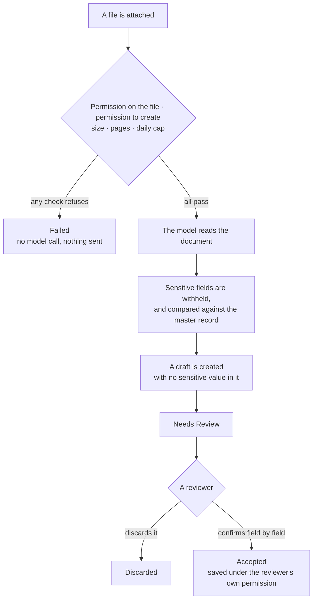

# Document extraction

An attached PDF or image becomes a draft somebody reviews. A supplier invoice
becomes a Purchase Invoice draft; a résumé becomes a Job Applicant draft.

Extraction never produces a finished document. It produces a draft with holes
where the risky values were, and a review screen for filling them.

## Starting one

An agent extracts when it has the **Extract** verb on the target doctype in its
access rules, and when the person it runs for may create that doctype. Ask it to
turn an attachment into a draft, or use the **Ask Agent** panel on the document
the file hangs off.

The file has to be a real File record on your site, reachable by name or by a
site URL. External URLs are refused — see [Files in chat](files-in-chat.md).

Watch progress under **Agents → Review → Needs Review**, or on the card in the
conversation.

## What gets refused before the model sees anything

The order of the checks is the design: everything that can refuse does so
*before* the model is called, so a refusal costs nothing and a hostile file
never reaches a provider on someone else's authority.

- Read permission on the file
- Permission to create the target doctype
- **Max Extraction File MB** — 10 by default
- **Max Extraction Pages** — 20 by default; a longer document is refused rather
  than silently trimmed
- **Extractions Per User Per Day** — 50 by default

All four caps live in **Agent Settings**.

Extraction reads **PDFs and images only**. Anything else is refused by type,
and says so. That is narrower than what an agent can *read* — a spreadsheet or a
Word file can be read into a conversation, but only a PDF or an image can be
turned into a draft.

The file goes to the model as the file. There is no rasterisation anywhere in
the app — nothing in a frappe environment can turn a PDF page into an image — so
the model profile must honestly declare **Supports PDF** or **Supports Images**.
A profile claiming support it does not have fails here.

For PDFs there is a **PDF Parser Engine** choice in Agent Settings. `native`
sends the document to the model itself. The OCR engines instead hand the model a
text layer that the reviewer never sees, which is faster and cheaper and puts a
step between the document and the answer.

## The sensitive-field gate

This is the part of extraction that exists because of one attack: a
genuine-looking invoice with the payment details changed.

Everything else on a document can be wrong and a reviewer catches it by reading.
A bank account cannot be checked by reading — only by comparing. So the gate
does two things, by construction rather than by warning.

**It withholds.** Any field you named in **Agent Settings → Sensitive Fields**
is pulled out of the extracted values before anything is written. The draft is
created from what is left, so **the draft cannot contain a sensitive value.**
The extracted values wait on the extraction record, flagged. Child rows count: a
payment detail inside a line item is the same attack with more steps.

**It compares.** When the extraction resolved a link to a master record that
carries the same field — the supplier whose IBAN you already hold — the master's
value is read server-side and compared. You get a mismatch flag you cannot miss.

Sensitivity comes from Agent Settings and nowhere else. The app ships no
knowledge of ERPNext fieldnames; a field is sensitive because an administrator
said so. **If you have not filled in Sensitive Fields, the gate has nothing to
hold back** — that list is the whole configuration of this feature, and on a
finance site it is the first thing to set.

Two details of the comparison are not optional, and explain behaviour you might
otherwise find odd. The master value is read as a document rather than through a
query, because v16 masks fields per user in the query layer and a masked value
would make every extraction mismatch forever — alert fatigue on the one alert
that must never be ignored. And a master value you are not permitted to see
unmasked is never written into the flags: you get the boolean, not the value.

## Reviewing

The review screen shows what was extracted, what it is confident about, any
duplicate warnings, and the sensitive fields waiting on you.

Ordinary values you can edit freely. A sensitive value is different: you confirm
it field by field, against the source document in front of you. **A sensitive
value that you did not explicitly confirm is dropped**, and the response names
what it dropped. This is the only path in the app that can write a sensitive
field into a document.

Accepting saves the draft under your own write permission, with nothing
bypassed, and validates it in full — the holes left for review have to be filled
before it is accepted. You cannot accept onto a document that is no longer a
draft, and you cannot accept an extraction someone already decided.

The result is still a draft. If it should be submitted, that is
[an approval](approvals.md), and a different person's decision.

## Duplicates

The same file attached in twenty places is one set of bytes, so extraction can
tell you when a file has been read before, and when the values look like a row
that already exists.

These checks have to look wider than the person they run for — a duplicate is by
definition somebody else's row — so every candidate is permission-checked before
it is named. What you may read comes back with its identity. What you may not
comes back as a count and nothing else. A duplicate flag naming a record you
cannot open would be an existence oracle wearing a helpful label.

## The states

| Status | Means |
|---|---|
| **Pending** | Queued |
| **Running** | The model is reading it |
| **Needs Review** | A draft exists and is waiting for a person |
| **Accepted** | A reviewer accepted it |
| **Discarded** | A person threw it away |
| **Failed** | It could not be done — reason on the row |

The job never raises. A failure is recorded on the Document Extraction row where
a human can read it, not swallowed into a log.

Discard wins a race. If you discard the request while the model is still
thinking, the reading finishes, its result is dropped, and the row says so.
