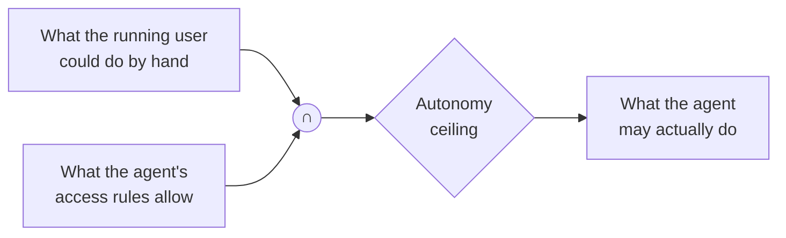
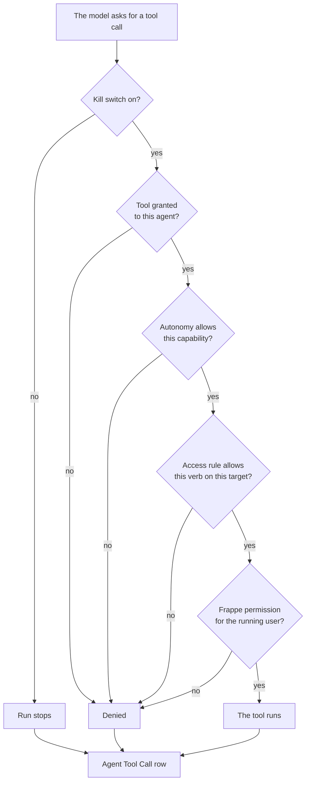

# How the agent is held to account

This is the page to read before you trust the app with a real site. Everything
else in these docs describes a feature; this describes the guarantees the
features are built on, and the places where a guarantee stops.

## An agent has no rights of its own

An agent is a record, not a service account. It never holds a permission. Every
run is bound to a real user, and that binding is what every check downstream
means something against.

An agent runs one of two ways, set by **Run As** on the Agent:

- **Session User** — the run acts as the person chatting. This is the normal
  case and the one to prefer.
- **Service User** — the run acts as a dedicated account you name and restrict
  yourself. It is still a real user with real permissions; there is no mode in
  which a run is unbound.

A run refuses to start as nobody, as Administrator or Guest, or as a user who is
disabled or missing. It fails on the Agent Run rather than falling back to
anything wider.

So the ceiling is: **the agent can never see or do more than the person it runs
for could do by hand.** Not usually — ever. If they cannot open a document,
neither can the agent, whatever else is configured.

## Rules narrow that ceiling, they never raise it

Access rules are the second half. Effective access is:

> what the user could do by hand **∩** what the agent's access rules allow

Turning on a rule hands nobody a permission. It only decides how much of their
own the agent may use. Both checks run on every call — frappe's permission
check and the rule check, never one instead of the other. See
[What an agent may reach](access.md) for the rules themselves.

## Agents draft, humans submit

Every tool carries a capability class, and the agent's **Autonomy** decides
which classes it may call at all:

| Autonomy | May call |
|---|---|
| Suggest | Read |
| Draft | Read, Draft |
| Write | Read, Draft, Write |

There is no autonomy level that grants Submit. No code path lets an agent
submit, cancel or delete a document. The most an agent can do is write a
proposal that a **different** person decides — see [Approvals](approvals.md).

That is a structural claim, not a policy one: the capability gate refuses a
Submit-class tool at every autonomy level, and no such tool is registered.

## Every call is on the record

Every tool call goes through one function, and that function always writes one
**Agent Tool Call** row — on success, on denial, and on error. A call torn down
mid-flight, because the run was cancelled, gets a row saying so. An auditor sees
attempts, not gaps.

Every path ends at the same row. There is no branch that does something and
writes nothing.

The row records the run, the tool, the arguments, the outcome, a summary of what
came back, which documents were touched, how long it took, and the error if
there was one. Long values are stored cut short and say where they were cut.

Agent Action rows behave the same way. The doctype grants create and write to no
role at all: a proposal can only arrive through the tool that makes one, and can
only leave through an approval, a rejection, or expiry.

### What the audit row holds back

The row is durable and an auditor reads it, so sensitive values are replaced
with `[redacted]` as it is written. What the call *did* stays legible — the
tool, the doctype, the field names, the outcome. Only values are removed.

A value is treated as sensitive when it is a Password field on the doctype the
call names, when an administrator marked it sensitive in **Agent Settings**, or
when its argument is named `password`, `api_key`, `token` or `secret`. Child
tables count at any depth: a payment detail inside a line item is the same value
with more steps.

Two deliberate limits worth knowing:

- The by-name fallback list is **short on purpose.** A rule wide enough to catch
  every secret by its name would redact half the audit trail, and a row an
  auditor cannot read is its own kind of failure. Mark the fields that matter in
  Agent Settings rather than relying on the names.
- Redaction happens at the write and nowhere else. **The tool's own return value
  goes to the model untouched.** This protects the audit trail, not the model
  call — what an agent may read is decided by permissions and rules, upstream.

## One switch turns it all off

**Agent Settings → Global Enabled** is the kill switch. It is on when the app is
installed. Clear it and every tool call is refused immediately, including calls
inside a run that is already in flight.

That last part is the hard part, and it is why the switch is read the way it is.
A background job holds one database transaction from start to finish, so a value
another connection wrote afterwards is invisible to it however often it asks —
and a cached copy of the settings is per process. So the switch is published to
the shared cache every time Agent Settings is **saved**, and the runtime counts
as on only when nothing says it is off.

The consequence to plan around: **flip the switch by saving Agent Settings.** A
value written straight into the database, bypassing a save, is not published,
and a run already going will not see it.

The switch also stops an approver applying an agent's proposal. A site that
distrusts the runtime should not have humans applying its output either.
Rejecting a proposal still works with the switch off — clearing the queue is
exactly what a stopped site should still be able to do.

## Document text is data, never instructions

Everything a person wrote — a comment, an email body, a description field —
reaches the model wrapped as untrusted content, tagged with where it came from.
Any attempt to close the wrapper early from inside the text is defused first.

This covers the long free-text fieldtypes, the ones with room to hide an
instruction: Text, Small Text, Long Text, Text Editor, HTML Editor, Markdown
Editor and Code. Data and Select values are short and structured and are not
wrapped.

Be clear about what this is: it is a strong, structural mitigation against
prompt injection, and it is **not a proof**. A model can still be talked into
proposing something foolish by text it was handed. That is why the draft/submit
wall exists — the wrapping reduces how often a model is fooled, and the approval
step is what makes being fooled survivable.

## The model is only handed what it asks for

A document does not arrive as a dump. The model first gets a manifest — what
exists around the document, as counts, never content — and then asks for one
slice at a time.

Read permission on the document is checked once, up front, before anything is
assembled. Every linked document is then checked individually, because a link is
a different document, not part of this one. Rows the permission system hid are
reported as a count, so the model knows something is there without learning what.

## What this does not guarantee

Worth stating plainly, because a docs page that only lists strengths is not
much use when you are deciding whether to trust something:

- **The model can be wrong.** Nothing here makes an extracted figure correct or
  a draft sensible. The guarantees are about authority and traceability, not
  accuracy.
- **Untrusted wrapping is a mitigation.** See above.
- **An auditor sees a lot.** Agent Tool Call rows carry argument and result
  summaries across every user's runs. That is the point of an audit trail, and
  it means the Agent Auditor role is a privileged one — grant it accordingly.
- **A permission you granted is a permission the agent can use.** The ceiling is
  the running user's own rights. If those are broad, narrowing the agent's
  access rules is the only thing keeping the agent narrow.
- **Cost is bounded but not zero.** `Max Steps` and the daily token budget stop
  a runaway loop; they do not make a misconfigured agent free.
